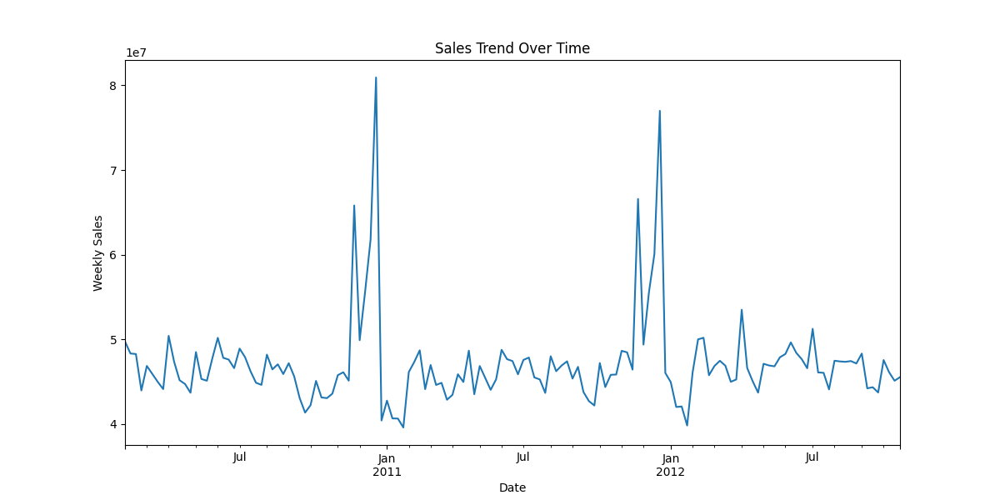
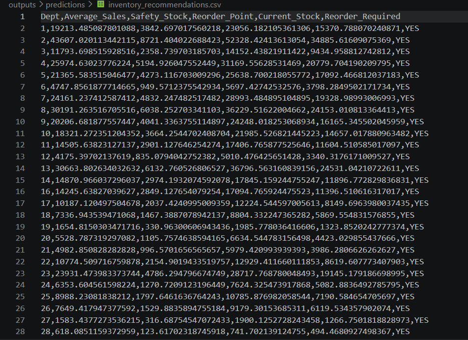
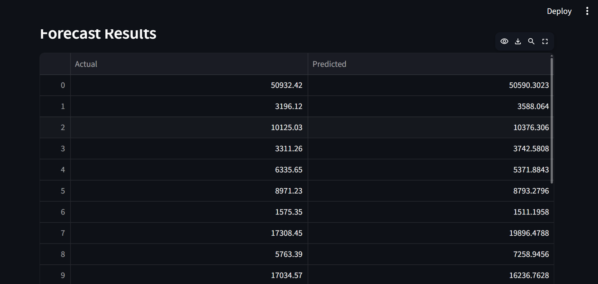

# Retail Sales Forecasting & Inventory Optimization System

## Project Overview

This project is an end-to-end retail analytics system designed to forecast future sales demand and optimize inventory decisions using machine learning and business logic.

The system helps retail businesses reduce stockouts, avoid overstocking, improve replenishment planning, and increase profitability.

It simulates a real-world retail forecasting environment using the Walmart Sales Forecasting Dataset.

---

## Problem Statement

Retail businesses often struggle with:

- Overstocking products
- Stockout situations
- Poor demand planning
- High inventory carrying costs
- Lost sales opportunities
- Manual replenishment decisions

This project solves these problems using data-driven forecasting and inventory optimization.

---

## Business Value

This system helps businesses:

- Predict future product demand
- Improve stock planning
- Reduce inventory waste
- Maintain safety stock
- Calculate reorder points
- Generate reorder recommendations
- Improve working capital efficiency

---

## Industry Relevance

Used by companies like:

- Amazon
- Flipkart
- Walmart
- Reliance Retail
- D-Mart
- BigBasket
- Supermarket chains
- E-commerce companies

This project reflects real use cases in:

- Data Analyst roles
- Business Analyst roles
- Retail Analyst roles
- Supply Chain Analyst roles
- Data Science roles

---

## Tech Stack

### Programming

- Python

### Libraries

- Pandas
- NumPy
- Matplotlib
- Seaborn
- Scikit-learn
- Statsmodels
- Streamlit
- Joblib

### Tools

- Jupyter Notebook
- VS Code
- Git
- GitHub

### Dataset

- Walmart Sales Forecasting Dataset (Kaggle)

---

## Project Architecture

```text
Historical Data
   ↓
Data Cleaning
   ↓
EDA
   ↓
Feature Engineering
   ↓
Forecasting Model
   ↓
Inventory Optimization
   ↓
Reorder Recommendation
   ↓
Dashboard + Reports
```

---

## Folder Structure

```text
Retail-Sales-Forecasting-Inventory-Optimization/
│
├── data/
│   ├── raw/
│   └── processed/
│
├── src/
├── outputs/
│   ├── charts/
│   ├── reports/
│   └── predictions/
│
├── app/
├── notebooks/
├── images/
├── docs/
│
├── README.md
├── requirements.txt
├── main.py
├── config.py
└── .gitignore
```

---

## Installation

### Step 1

Install Python 3.10+

### Step 2

Install required libraries

```bash
pip install -r requirements.txt
```

### Step 3

Download dataset from Kaggle

Search:

Walmart Sales Forecasting Dataset

Place files inside:

```text
data/raw/
```

Required files:

- train.csv
- stores.csv
- features.csv

---

## How to Run

### Run Main Project

```bash
python main.py
```

### Run Dashboard

```bash
streamlit run app/dashboard.py
```

---

## Outputs Generated

### Charts

- sales_trend.png

### CSV Reports

- forecast_results.csv
- inventory_recommendations.csv

---

## Simulation Workflow

1. Load historical sales data
2. Clean and merge datasets
3. Perform feature engineering
4. Train forecasting model
5. Predict future sales
6. Calculate safety stock
7. Calculate reorder point
8. Generate reorder alerts
9. Visualize business insights

---

## Results

### Forecasting

Random Forest model used for weekly sales prediction.

Metrics:

- MAE
- RMSE

### Inventory Optimization

Generated:

- Safety Stock
- Reorder Point
- Reorder Required Flag

---

## Screenshots

### Sales Trend



### Inventory Recommendations



### Dashboard



---

## Future Improvements

- Multi-store forecasting
- Product-level forecasting
- Promotion impact modeling
- Price elasticity analysis
- Real-time dashboard
- ERP integration
- Weather-based forecasting
- Region-wise demand prediction

---

## Learning Outcomes

This project demonstrates:

- Retail Analytics
- Demand Forecasting
- Inventory Optimization
- Machine Learning
- Business Problem Solving
- GitHub Project Structuring
- Dashboard Development

---

## Author

Khadeejath Sana

Computer Science Student | Aspiring Data Analyst

Building practical projects in:
- Data Analytics
- Machine Learning
- Forecasting Systems
- Business Intelligence

GitHub: https://github.com/K-SANA-ezlyn

LinkedIn: https://www.linkedin.com/in/khadeejath-sana-631b3632b/

